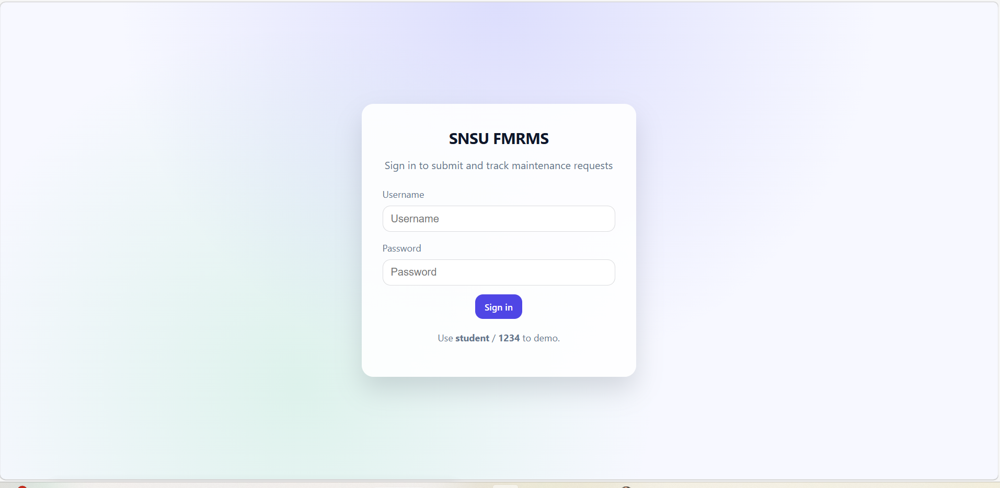
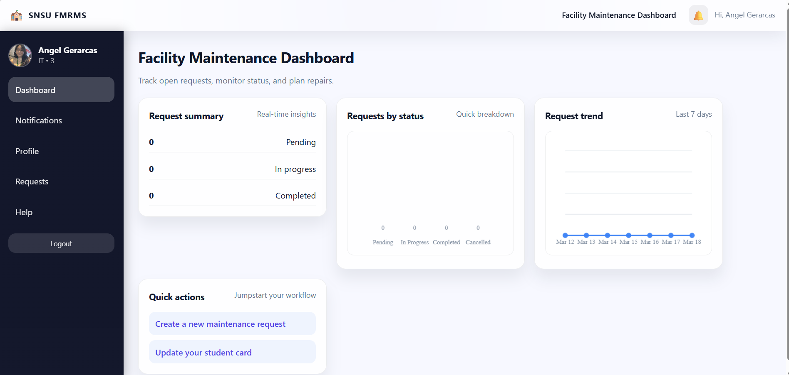
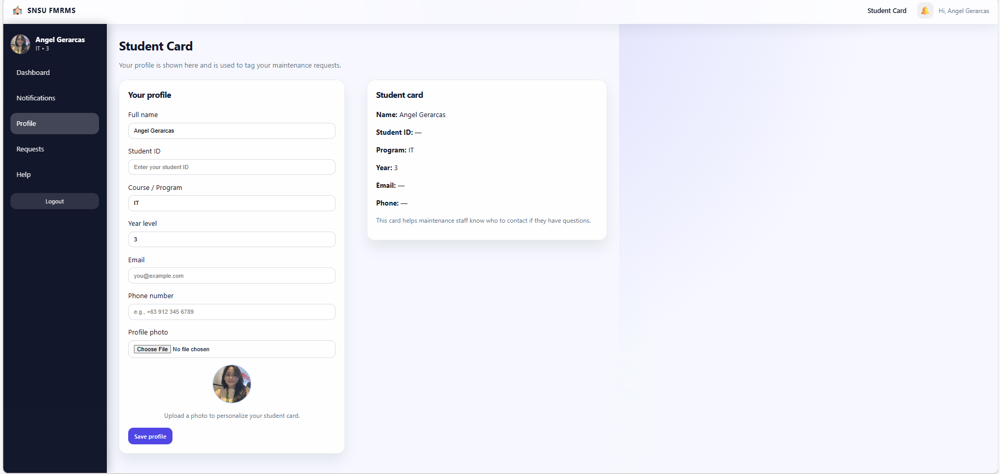
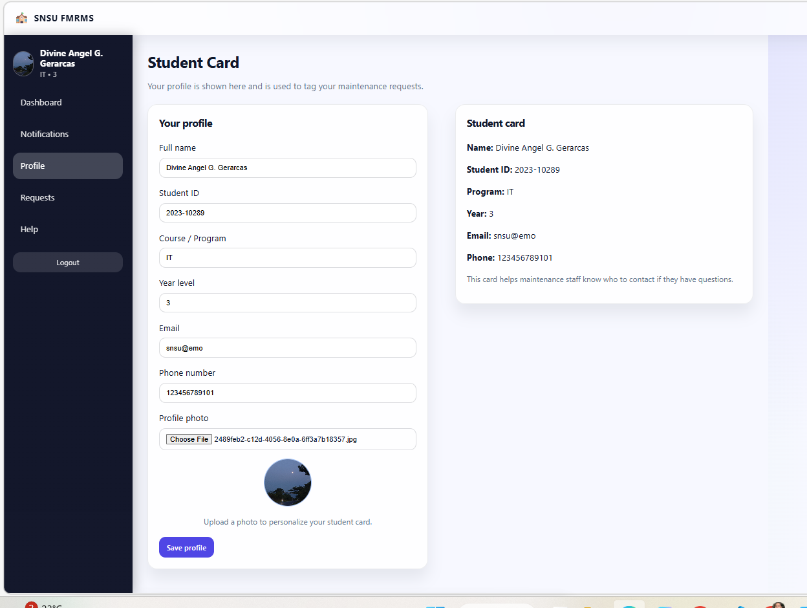
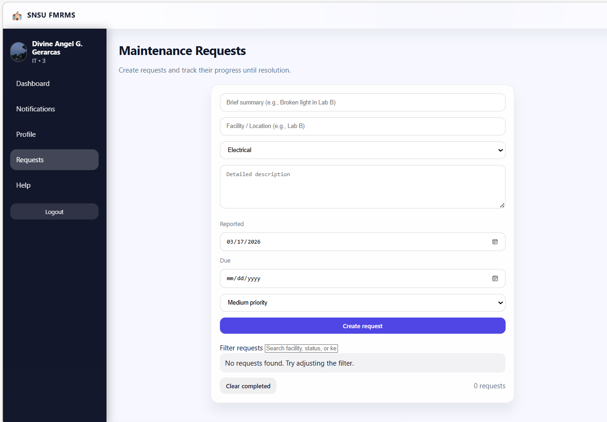
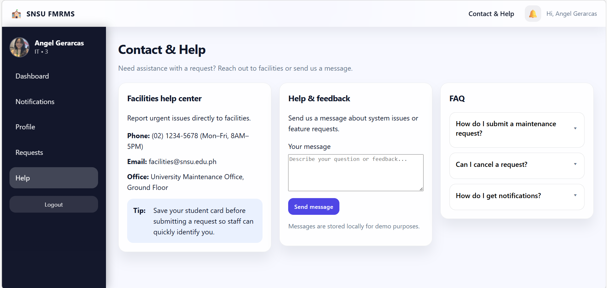
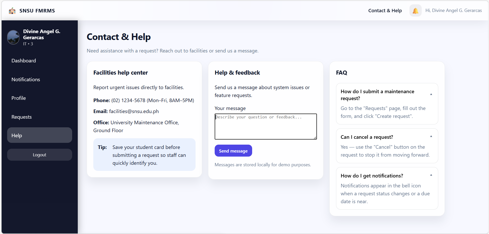
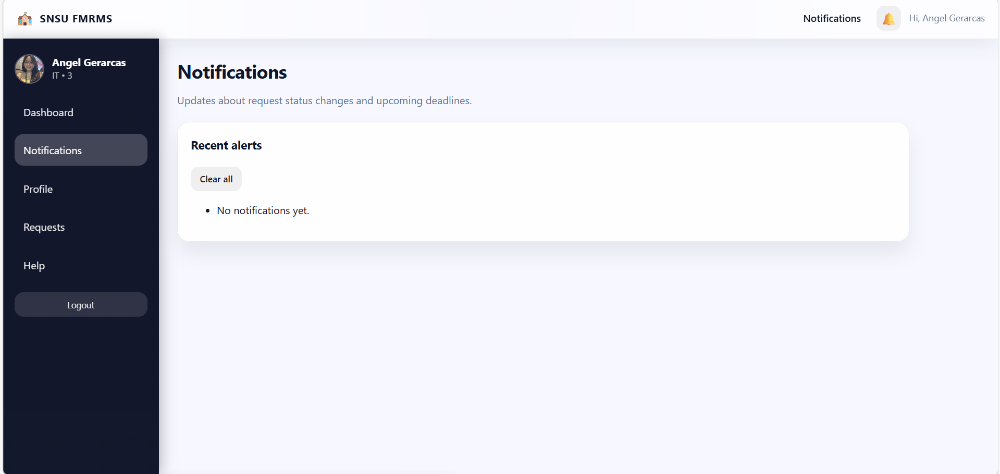

# SNSU FMRMS – Assignment 1

## Features Implemented
1. Student Profile Card
2. FAQ Section

---

## Mini Specs

### Feature 1: Student Profile Card
- **Purpose**: Display key student information in a structured card for quick reference.
- **Expected User**: Students and university staff.
- **Main Functionality**: Shows name, ID, program, year level, and contact details.
- **Acceptance Criteria**:
  1. Card displays all required fields (Name, ID, Program, Year, Email, Phone).
  2. Updates automatically when the student edits their profile (auto-save + real-time preview).
  3. Works offline without needing an internet connection (data stored in localStorage).

### Feature 2: FAQ Section
- **Purpose**: Provide quick answers to common student questions.
- **Expected User**: Students using the app for guidance.
- **Main Functionality**: A collapsible list of questions with answers.
- **Acceptance Criteria**:
  1. FAQ entries are displayed in a clean list format.
  2. Clicking a question expands to show the answer.
  3. Works locally without requiring internet access.

---

## What Was Implemented
- Profile card connected to student data model (stored in `localStorage`).
- Auto-updating profile card (real-time update while editing).
- FAQ section with expandable answers (accordion UI with smooth animation).

---

## Problems / Challenges
- Ensuring the profile card updates live while editing (solved with debounce + preview).
- Keeping styling consistent with the existing UI while adding accordion behavior.

---

## Running Locally
1. Open `index.html` in a browser.
2. Log in using:
   - Username: `student`
   - Password: `1234`
3. Visit **Profile** to edit and view the profile card.
4. Visit **Help** to see the FAQ accordion.

---

## Screenshots

### Login Page

### Dashboard

### Profile Card (initial view)

### Profile Card (after editing)

### Requests Page

### FAQ Section (collapsed)

### FAQ Section (expanded)

### Notifications Page

